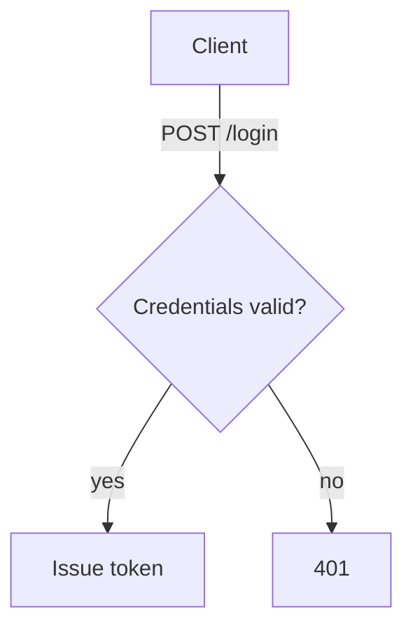

# Spectacle — Markdown viewer and quality gate for AI-written documents

A Windows-only Markdown viewer. Renders `.md` / `.markdown` files with VS Code-preview fidelity,
Mermaid diagrams included. Dark and light themes (toggle with `Ctrl+T`). WCAG-accessible. No
editing. Open files and jump back to recent ones without leaving the keyboard. Export any document
to a self-contained HTML file — diagrams and all, drawn offline — and see live word count /
reading time in the status bar.

It is also a **quality gate for Markdown an AI workflow wrote**. Open a generated document and a
badge in the corner tells you whether it passes, with every finding and its fix one keypress away
(`v`). Run the same thing headlessly and you get an exit code:

```bash
Spectacle.exe design.md --gate                 # 0 = ship it, 1 = findings, 2 = bad input
Spectacle.exe design.md --fix-brief brief.md   # the revision list, addressed to the authoring agent
my-agent write | Spectacle.exe - --gate --json # gate a document that was never written to disk
```

And it is a **cockpit for the write → gate → revise loop itself**. Leave the document open while
your agent revises it: every save re-renders, re-grades, and lands as an iteration in the reader's
memory — a toast says what the save fixed and what it broke, edge markers show exactly which
blocks changed, and `l` opens the session's convergence timeline. In the findings panel, `Space`
waives what you disagree with and `c` copies a fix brief covering the rest — the next prompt for
the authoring agent, assembled without leaving the reader. And when the
[Claude Code CLI](https://claude.com/claude-code) is installed on the machine, even the copying is
unnecessary: `a` hands that brief to `claude -p` in a background process that revises the open
document **in place**, so the saves land right back in the loop you are watching. The same two
keys serve *your* review too: with the panel closed, `c` and `a` carry the unresolved comments
you left on blocks instead of the gate's findings — the panel is the modifier deciding what gets
revised. See [The revision loop](#the-revision-loop-in-the-reader) and
[Hands-free revision](#hands-free-claude-revises-the-document-in-place).


New here? [QUICKSTART.md](QUICKSTART.md) is the first ten minutes plus the vocabulary — every
term the UI puts on screen (gate, finding, blocking, iteration, waive…) defined in one line each.

The gate is one command over ~40 rules, graded by severity, configured once per project, and
emitted in whatever your pipeline reads — its own JSON, SARIF, GitHub Actions annotations, JUnit
XML, or Markdown for a pull request. Five things make it a *workflow* gate rather than a linter:

- **Front matter is data.** The YAML header a workflow stamps on its output is parsed, validated
  against a required-key template, rendered as a metadata card, and echoed into the verdict so a
  downstream step can route on it — instead of being read as prose. See
  [The metadata header](#the-metadata-header).
- **Generation residue is a defect.** Unsubstituted `{{tokens}}`, `Certainly! Here's the updated…`,
  `rest of the file unchanged`, `path/to/file` links — the failures that only happen when a model
  writes the file. See [Generation residue](#generation-residue).
- **Findings come with fixes.** `--fix-brief` rewrites the verdict as instructions for the tool
  that authored the document, ordered so applying one never invalidates the next one's line
  number. See [Closing the loop](#closing-the-loop-with-fix-brief).
- **The reader shows the same verdict.** Not an approximation of it — literally the same computed
  result, so a green badge and a green pipeline are the same statement. See
  [The gate in the reader](#the-gate-in-the-reader).
- **The reader remembers the loop.** Each save an agent makes becomes an iteration with a delta
  (fixed / new / remaining) and a marked set of changed blocks, and the findings panel triages
  straight into the next revision brief. See
  [The revision loop](#the-revision-loop-in-the-reader).

## Install

1. `dotnet publish src/Spectacle -p:PublishProfile=win-x64`
2. Copy `publish/win-x64/Spectacle.exe` to `C:\Tools\Spectacle\`.
3. Run `C:\Tools\Spectacle\Spectacle.exe --register` to set as the default handler for `.md` / `.markdown` (per-user, no admin).
4. Optional PowerShell helper, in `$PROFILE`:
   ```powershell
   function spectacle { param([string]$Path) & 'C:\Tools\Spectacle\Spectacle.exe' $Path }
   ```

## Usage

```text
Spectacle.exe <file|dir> --gate [--json|--md|--sarif|--github|--junit] [--fail-on=error|warning] [--only=a,b|--skip=a,b]
                                               Run every check, grade each finding, then exit (non-zero only at or above the threshold)
Spectacle.exe <file> --fix-brief [out] [--json]  Write the gate's findings as revision instructions for the authoring tool, then exit
Spectacle.exe <file.md|file.markdown>          Open and render
Spectacle.exe <file> --stats                   Print word count, reading time and structure, then exit
Spectacle.exe <file> --export-html [out.html]  Export a self-contained HTML file, then exit
Spectacle.exe <file> --export-html --light     Export using the light theme (defaults to dark)
Spectacle.exe <file> --revision-plan [out] [--json] [--unresolved]  Export the review's revision plan, then exit
Spectacle.exe <file> --review-summary [--json]  Print review status (open/resolved/orphaned), then exit
Spectacle.exe <file> --lint [--json]           Report spec readiness issues, then exit (non-zero if any)
Spectacle.exe <file> --outline [--json]        Print the heading outline, then exit
Spectacle.exe <file> --checklist [--json]      Report task-list/acceptance-criteria completion, then exit
Spectacle.exe <file> --check-links [--json]    Report broken internal links, then exit (non-zero if any)
Spectacle.exe <file> --diff <other> [--json]   Show block-level changes vs another spec, then exit
Spectacle.exe <file> --check-structure [--json]  Report heading-hierarchy issues, then exit (non-zero if any)
Spectacle.exe <file> --check-tables [--json]   Report malformed tables, then exit (non-zero if any)
Spectacle.exe <file> --check-fences [--json]   Report fenced-code-block issues (unclosed, untagged), then exit
Spectacle.exe <file> --check-paths [--json]    Report relative link/image targets missing on disk, then exit (non-zero if any)
Spectacle.exe <file> --check-sections ["A,B,C"] [--config=<cfg>] [--json]  Report required sections (by heading) missing from the spec, then exit (non-zero if any)
Spectacle.exe <file> --check-duplication [--json]  Report blocks repeated verbatim elsewhere in the spec, then exit (non-zero if any)
Spectacle.exe <file> --check-alt-text [--json]  Report images missing alt text, then exit (non-zero if any)
Spectacle.exe <file> --check-link-text [--json]  Report links whose text names no destination, then exit (non-zero if any)
Spectacle.exe <file> --check-emphasis-heading [--json]  Report emphasized lines used as fake headings, then exit (non-zero if any)
Spectacle.exe <file> --check-prose [--json]    Report vague/hedging language, then exit (advisory — always exits 0)
Spectacle.exe <file> --check-toc [--json]      Report a table of contents out of sync with the headings, then exit (non-zero if any)
Spectacle.exe <file> --check-numbering [--json]  Report ordered lists whose numbering is out of sequence, then exit (non-zero if any)
Spectacle.exe <file> --check-bare-urls [--json]  Report bare (auto-linked) URLs that should be descriptive links, then exit (non-zero if any)
Spectacle.exe <file> --check-heading-numbering [--json]  Report manually numbered headings out of sequence, then exit (non-zero if any)
Spectacle.exe <file> --check-link-refs [--json]  Report reference-style links whose label has no definition, then exit (non-zero if any)
Spectacle.exe <file> --check-footnotes [--json]  Report footnote references with no matching definition, then exit (non-zero if any)
Spectacle.exe <file> --check-front-matter ["a,b"] [--config=<cfg>] [--json]  Report a missing/unclosed/incomplete YAML metadata header, then exit (non-zero if any)
Spectacle.exe <file> --check-ai-artifacts [--json]  Report generation residue (unfilled tokens, chat framing, truncation markers, placeholder targets), then exit (non-zero if any)
Spectacle.exe <file> --check-mermaid [--json]  Report Mermaid diagrams that cannot be drawn (empty, unknown type) or carry no description, then exit (non-zero if any)
Spectacle.exe <file> --review [--json|--sarif|--md|--github|--junit] [--only=a,b|--skip=a,b]  Run all checks at once, then exit (non-zero if any issues)
Spectacle.exe <dir> --review [--json|--sarif|--md|--github|--junit]  Review every spec under a folder at once, then exit (non-zero if any issues)
Spectacle.exe <file> --review --baseline <old> [--json]  Show what a revision fixed/introduced vs an older version, then exit
Spectacle.exe --init-config [path] [--force]   Scaffold a documented .spectacle.json (refuses to overwrite without --force), then exit
Spectacle.exe --register                       Register file association
Spectacle.exe --unregister                     Remove file association
Spectacle.exe --help                           Show help
Spectacle.exe --version                        Show version, build commit and commit date
```

`--version` answers with the commit the binary was built from, not a static number:
`1.0.0+9f2c1ab.2026-08-23` is the version, the short sha and that commit's date. A `.dirty` suffix
means the build came from an edited working tree, so the sha names a commit the binary does not
quite contain. A source tree without `.git` reports the bare version.

`--export-html` writes a portable, single-file HTML document (theme and syntax-highlight
styling inlined, no external assets; the Mermaid renderer too when the document has a diagram) next
to the source — defaulting to `<file>.html` — or to the optional output path. Add `--light` to
export the light theme instead of the default dark one. `--stats` and `--export-html` run headless
and never open a window.

`--revision-plan` writes the review's revision plan — the review you build interactively with
comments (which the reader itself turns into a revision brief: press `c` with the findings panel
closed) — headlessly, so you can pipe a review back to the AI agent that authored the spec. It re-anchors your saved
comments against the current source (dropping orphans whose blocks no longer exist) and defaults
to `<file>.revisions.md`, or the optional output path. Add `--json` for a structured
`<file>.revisions.json` an agent can apply programmatically. Add `--unresolved` to emit only
open comments, so you hand the agent just the outstanding work. Runs headless, never opens a window.

`--review-summary` prints where a review stands — total comments, how many are open vs resolved,
and how many still anchor to a current block (`Anchored`) vs point at content the agent has since
changed or removed (`Orphaned`). Add `--json` for a machine-readable summary. Like `--stats`, it
writes to stdout and never opens a window.

`--lint` reports common readiness gaps in an AI-authored spec: leftover placeholder markers
(`TODO`, `TBD`, `FIXME`, `<placeholder>`, `lorem ipsum`, … — ignoring fenced code) and empty <!-- spectacle-disable-line lint -->
sections (a heading with no content of its own and no subsection beneath it). It prints each
finding with a line number and exits non-zero when any are found, so it can gate a pipeline; add
`--json` for structured findings.

`--outline` prints the document's heading tree (indented by level, with line numbers) so you can
grasp a spec's structure at a glance or feed it to tooling. Add `--json` for a structured outline.

`--checklist` tracks acceptance criteria: it finds GFM task-list items (`- [ ]` / `- [x]`, ignoring
fenced code), reports how many are complete, and lists the open ones with line numbers. Add `--json`
for structured items.

`--check-links` validates the spec's internal links — anchor links (`#section`) must resolve to a
heading slug or an explicit element id, and link targets must be non-empty (external and relative
links are left alone). It prints each broken link with a line number and exits non-zero when any are
found, so it can gate a pipeline; add `--json` for structured findings.

`--diff <other>` shows what changed between two versions of a spec — invaluable when an AI agent
revises its own output. It compares blocks structurally (a block is unchanged only if its text is
identical), reporting added (`+`) and removed (`-`) blocks with line numbers; an edit shows as one
removed plus one added. The named `<other>` is the baseline and the opened `<file>` is the revision.
Add `--json` for structured added/removed arrays.

`--check-structure` validates the heading hierarchy (distinct from `--lint`'s content checks): more
than one top-level `#` heading, skipped levels (e.g. `##` jumping straight to `####`), and duplicate
heading text (which also produces ambiguous anchors). It exits non-zero when any are found; add
`--json` for structured findings.

`--check-tables` validates GFM pipe tables: every separator and body row must have the same number
of cells as the header. It flags mismatches with line numbers and exits non-zero when any are found;
add `--json` for structured issues.

`--check-fences` validates fenced code blocks — the kind AI agents routinely emit malformed. It
reports two rules: `unclosed-fence` (a fence opened but never closed, which swallows the rest of the
document into one code block — a real rendering defect) and `no-language` (a closed fence with no
language/info string, which renders without syntax highlighting — advisory). Closing is judged the
CommonMark way: a closing fence repeats the opener's delimiter character (`` ` `` or `~`) at least as
many times with no info string, and a run of the *other* delimiter inside a block is content, not a
toggle. It exits non-zero only when a fence is genuinely unclosed (so it can gate a pipeline without
failing on a stylistic missing tag); add `--json` for structured issues.

`--check-paths` validates the spec's *relative* link and image targets against the filesystem — the
gap `--check-links` deliberately leaves alone. AI agents frequently reference files and images that
were never created (hallucinated paths); this catches them by resolving each relative target against
the spec's own directory and reporting the ones that don't exist on disk. It strips any `#fragment`
or `?query` and percent-decodes before resolving. External targets (any URI scheme, protocol-relative
`//host`), in-document anchors (`#section`), and site-absolute paths (`/foo`) are left alone. It exits
non-zero when any relative target is missing; add `--json` for structured findings.

`--check-sections "A,B,C"` enforces a spec **template** — the one gap the other checks
leave open. Every other check validates what is *present*; none notices what an AI agent
*omitted*. Pass the sections your specs must contain as a comma-separated list (in the
second positional, like `--diff`'s file) and Spectacle reports each one with no matching
heading. Matching is by exact heading text, case-insensitive and trimmed, at any level — a
required `Acceptance Criteria` is satisfied by `## Acceptance Criteria` or `#### Acceptance
Criteria` alike, but a required `Goals` is *not* satisfied by a `Non-Goals` heading (it is a
full-text match, not a substring). Missing sections are reported in the order requested; it
exits non-zero when any are absent, so it can gate a pipeline. Add `--json` for structured
findings.

The list is optional. Omit it and Spectacle reads the required sections from a
**`.spectacle.json`** config, so a team declares its spec template once instead of retyping
it on every invocation. The config is a JSON object with a `requiredSections` string array:

```json
{ "requiredSections": ["Overview", "Acceptance Criteria", "Non-Goals"] }
```

The same config declares everything else the gate needs, so one file per project is the whole
setup:

```json
{
  "requiredSections": ["Overview", "Acceptance Criteria", "Non-Goals"],
  "requiredFrontMatter": ["workflow", "stage", "run.model"],
  "disabledChecks": ["duplication"],
  "severity": { "bare-urls": "warning", "toc/missing-from-toc": "error" },
  "failOn": "error"
}
```

| Key | What it does |
|---|---|
| `requiredSections` | Headings every document must contain (`--check-sections`, `--review`, `--gate`) |
| `requiredFrontMatter` | YAML metadata keys every document must declare, dotted for a nested field — see [The metadata header](#the-metadata-header) |
| `disabledChecks` | Gating checks to turn off, by id — see [Tuning the gate](#tuning-the-gate) |
| `severity` | Regrade a check or a single rule for `--gate` — see [Severities](#severities-and-why-they-beat-switching-checks-off) |
| `failOn` | The lowest severity that fails `--gate` (`error`, the default, or `warning`) |

Discovery walks up from the spec's own directory and takes the nearest `.spectacle.json`
(the "closest config wins" rule editors and linters use), so a spec inherits the settings of
its enclosing project automatically. Point at a specific file with `--config=<path>`. An
inline list always wins over config; a malformed or missing config never crashes the check
(it resolves to no required sections, and `--check-sections` with nothing to enforce exits
non-zero with a hint rather than silently passing).

`--init-config` scaffolds that file so a team can adopt the project gate in one step instead
of authoring JSON by hand. It writes a documented `.spectacle.json` — a starter
`requiredSections` template, an empty `requiredFrontMatter` and `disabledChecks`, the grading
policy at its defaults, and a `"//"` note per field explaining what it does and naming every valid
check id (sourced from the live check set, so the scaffold can't advertise a stale one) — to the
current directory, to a directory you name (`--init-config
specs`), or to an explicit path. Editing it is the point: trim the required sections to your
template and list any checks you want off. Writing over an existing config would discard a
team's tuning, so it **refuses to overwrite** unless you pass `--force`; it prints the full
path it wrote and exits 0 (2 when it refused).

`--check-emphasis-heading` flags a paragraph that is nothing but a single bold or italic run
on its own line — `**Overview**` or `_Goals_` where the agent meant `## Overview`. It looks
like a heading but is not one, so it is invisible to every heading-based command here:
`--outline` never lists it, `--check-sections` never counts it as a present section, and
`--check-structure` cannot reason about its level. Catching it keeps the rest of the heading
toolchain trustworthy. It mirrors markdownlint's MD036: only a single-line paragraph whose
*entire* content is one emphasis run is flagged, and one ending in sentence punctuation
(`. , ; : ! ?`) is left alone (an emphasized *sentence* is not a heading). Only top-level
paragraphs count — an emphasized list item (`- **Term**`) or blockquote line is a legitimate
construct. It exits non-zero when any are found, so it can gate a pipeline; add `--json` for
structured findings.

`--check-duplication` flags content an AI agent repeated verbatim — the same paragraph,
list item, code block, or table appearing twice in the spec. Agents pad output by restating
a requirement in two sections or pasting the same boilerplate into multiple places, and every
other check looks at one block in isolation, so a verbatim repeat slips through. It compares
blocks by kind and normalized text (the same whitespace-insensitive comparison `--diff` uses),
reports each repeat with its line and the line of the first occurrence it duplicates, and skips
blocks shorter than a small threshold (separators, one-word labels repeat legitimately). It
exits non-zero when any block repeats, so it can gate a pipeline; add `--json` for structured
findings.

`--check-alt-text` reports images with no alt text — the `` form an agent emits
when it drops a screenshot or diagram into a spec without describing it. Alt text is what a
screen reader announces and what shows when the image fails to load, so a missing description
is a genuine accessibility defect; `--check-links` deliberately skips images, so nothing else
catches it. An image is flagged when the text between `![` and `]` is empty or only whitespace;
the target is reported so the finding points at a recognizable image (whether that relative
target exists on disk is `--check-paths`' concern). It exits non-zero when any image lacks alt
text, so it can gate a pipeline; add `--json` for structured findings.

`--check-link-text` reports links whose visible text says nothing about where they go —
the `[click here](…)` / `[link](…)` / `[read more](…)` boilerplate AI agents reach for
instead of naming the destination. Link text is what a screen reader announces out of
context (a user tabbing through links hears only the text) and what a reader scans, so
`here` or `this` is a genuine accessibility and clarity defect — the link analogue of the
missing alt text `--check-alt-text` catches, which nothing else looks at (`--check-links`
validates only that a link's *target* resolves, never its text). Two rules: `non-descriptive`
(the text is one of a tight, curated set of generic phrases — `click here`, `here`, `link`,
`more`, `read more`, …, matching markdownlint's MD059 defaults) and `empty` (the text between
`[` and `]` is blank, distinct from `--check-links`' empty-*target* rule). The phrase list is
deliberately conservative — only wording that is non-descriptive in essentially every context —
to keep the false-positive rate low, the same stance `--check-prose` takes. Images are skipped
(their text is alt text). It exits non-zero when any link is uninformative, so it can gate a
pipeline; add `--json` for structured findings.

`--check-prose` flags the hedging and vague filler language that is the signature defect
of AI-authored specs — wording that *looks* like a requirement but commits to nothing, so
neither a reader nor the next agent can tell what to build. It reports three rules: `hedge`
(uncertainty that signals an undecided spec — `should probably`, `may need to`, `perhaps`),
`weasel` (open-ended fillers with no concrete meaning — `etc.`, `and so on`, `various`,
`a number of`), and `vague-directive` (instructions that defer the real decision — `as
appropriate`, `where applicable`, `to be determined`). The word list is deliberately tight
(multi-word phrases and unambiguous fillers, not common words like "many" or "often" that
have legitimate uses), and fenced code is skipped. Because hedging is a judgement call,
this check is **advisory**: it prints findings but always exits 0, never gating a pipeline —
the same report-don't-fail stance as `--check-fences`' `no-language` rule. Add `--json` for
structured findings.

`--check-toc` validates a spec's **table of contents** against its actual headings — the
drift an AI agent introduces when it adds, renames, or removes a section but forgets to
update the TOC. It recognizes a TOC by a heading named `Table of Contents`, `Contents`, or
`TOC` (case-insensitive) followed by a list of in-document anchor links, and reports two
defects: `stale-toc-entry` (an entry pointing at `#anchor` that matches no heading — the TOC
references a section that was removed or renamed) and `missing-from-toc` (a body section the
TOC omits). The depth the TOC is expected to cover is inferred from the entries that do
resolve, so a deeper subsection the TOC never meant to list is left alone, and only headings
*after* the TOC count as entries it should carry. The check is a **no-op when the spec has no
TOC**, so a spec that never declared one is unaffected. It uses the same Markdig
auto-identifier slugs as `--check-links`, so the anchors matched here are the ones the viewer
emits. It exits non-zero when the TOC is out of sync, so it can gate a pipeline; add `--json`
for structured findings.

`--check-numbering` validates the numbering of **ordered lists** — the broken step or
requirement sequences an AI agent emits when it drops, duplicates, or reorders an item
(`1. 2. 2. 4.`). A reviewer skims a numbered spec by its numbers, so a gap or a repeat reads
as a missing step even when the prose is intact. Following markdownlint's MD029
`one_or_ordered` spirit, a list passes when its source markers are either *all the same* (the
lazy `1. 1. 1.` style every renderer numbers sequentially) or *strictly consecutive* from
whatever the first item starts at (`1. 2. 3.`, `0. 1. 2.`, `3. 4. 5.`); anything else is one
`out-of-sequence` finding, anchored at the first item that breaks the run. Each list —
including a nested one — is judged on its own, and code fences are ignored. Keeping both
legitimate styles clean holds the false-positive rate low enough to gate, so it exits
non-zero when a list is out of sequence; add `--json` for structured findings.

`--check-bare-urls` reports bare URLs pasted straight into the prose — `https://example.com`
sitting in a sentence rather than a descriptive Markdown link. GFM auto-links such text, so it
renders as a link whose *visible text is the raw URL*: a screen reader reads the whole address
aloud and a reader scanning the page learns nothing about where it goes. It is the link analogue
of the missing alt text `--check-alt-text` catches and the worst case of the non-descriptive text
`--check-link-text` flags — the text *is* the URL — which is why neither of those looks at it (a
bare URL has no authored text to inspect). Only the bare, undelimited form is flagged; the two
legitimate ways to write a URL verbatim are deliberately left alone, so the rule keeps a clean
escape hatch: an explicit autolink (`<https://example.com>`, the CommonMark "render this as a link
on purpose" syntax) and a code span (`` `https://example.com` ``, when the URL is a literal value
like an API endpoint — Markdig never auto-links inside code). A proper `[text](url)` link is never
flagged, and URLs inside fenced or indented code are skipped for the same reason a code span is. It
exits non-zero when any bare URL is found, so it can gate a pipeline; add `--json` for structured findings.

`--check-heading-numbering` validates the numbering of *manually numbered headings* — the broken
section sequences an AI agent emits when it drops, duplicates, or reorders a section (`## 1. Goals`,
`## 2. Design`, `## 4. Rollout` — where did 3 go?). It is the heading analogue of `--check-numbering`,
which judges ordered *lists* only; a reviewer skims a numbered spec by its section numbers exactly as
they skim a numbered list, so a gap or repeat reads as a missing section even when the prose is intact.
Only flat, single-integer prefixes participate — a heading whose text begins with an integer then `.`
or `)` then whitespace (`1. `, `2) `, `10. `). Dotted hierarchical numbering (`1.2 Detail`) is
deliberately ignored: detecting it reliably and validating a full outline is a far more
false-positive-prone problem, and a spec that never numbers its headings is wholly unaffected (the
same "enforced only when present" stance the TOC and section-template checks take). Numbered headings
are grouped into runs by heading level, and a run is closed whenever a *shallower* heading intervenes
— so sub-section numbering that legitimately restarts under each new parent (`### 1.`, `### 2.` under
one `##`, then `### 1.` again under the next) is never flagged. Following markdownlint's MD029
`one_or_ordered` spirit, each run passes when its numbers are either *all the same* (the lazy `1. 1. 1.`
style) or *strictly consecutive* from whatever the first heading starts at; anything else is one
`out-of-sequence` finding, anchored at the first heading that breaks the run. It exits non-zero when a
run is out of sequence, so it can gate a pipeline; add `--json` for structured findings.

`--check-link-refs` validates *reference-style* links and images — the `[visible text][label]`
(full) and `[label][]` (collapsed) forms whose target lives in a separate `[label]: url`
definition. When the definition is missing, CommonMark renders the reference as the *literal
bracketed text*: `[the API docs][api]` with no `[api]:` definition ships to the reader as the
broken string `[the API docs][api]`. AI agents produce exactly this when they restructure a spec
and drop the definition (or cite a label they never define). Because the unresolved reference is
plain text — never a link on the parsed document — `--check-links` (which validates resolved
`#anchor` targets) cannot see it; this check scans the raw reference syntax instead. Definitions
are read from the parsed document, so indentation, link titles, and multi-line targets resolve
correctly, and label matching follows CommonMark (case-insensitive, internal whitespace
collapsed). Only the full and collapsed forms are flagged: an undefined *shortcut* reference
(`[label]`) is, by the spec, indistinguishable from ordinary bracketed prose and renders cleanly,
so it is never a defect; references inside code spans and fenced blocks are skipped. It exits
non-zero when any reference has no definition, so it can gate a pipeline; add `--json` for
structured findings.

`--check-footnotes` is the footnote analogue: it flags footnote references (`[^id]`) that have no
matching `[^id]: …` definition. As with an unresolved reference link, Markdig renders an undefined
footnote marker as the literal text `[^id]` rather than a citation, so a reader sees a stray
bracketed token where a source should be — a common artifact when an agent cites a footnote it
forgot to define, or deletes a definition without removing its references. The definition set is
read from the parsed document; a definition's own opening marker (`[^id]:`) is never treated as a
reference, label matching is case-insensitive, and markers inside code are ignored. It exits
non-zero when any footnote reference is undefined, so it can gate a pipeline; add `--json` for
structured findings.

`--review` is the one-shot verdict: it runs the whole gating battery together — `--lint`,
`--check-structure`, `--check-links`, `--check-tables`, `--check-fences` (unclosed fences only —
the advisory missing-tag rule is surfaced separately, see below), `--check-paths`,
`--check-duplication`, `--check-alt-text`, `--check-link-text`, `--check-emphasis-heading`,
`--check-sections`, `--check-toc` (a no-op unless the spec has a TOC), `--check-numbering`,
`--check-bare-urls`, `--check-heading-numbering`, `--check-link-refs`, `--check-footnotes`,
`--check-front-matter` (a no-op unless the project declares a metadata template or the header is
malformed), `--check-ai-artifacts`, and `--check-mermaid` (a no-op unless the document has a
diagram) —
groups the findings by category with a combined issue count, and includes the checklist
completion tally. It exits non-zero if any check found an issue — so an agent or CI step can call a
single command to decide whether a spec is ready. Add `--json` for a structured report with one
array per check.

**Advisories.** `--review` also surfaces an `advisories` section — the guidance the gate
deliberately does not fail on, so it no longer requires a separate run to see. It carries the
`--check-prose` findings (hedging / vague language) and the fence `no-language` rule (a closed
but untagged code block). Advisories are reported in the text, `--json` (an `advisories` object
plus an `advisoryCount`), and `--md` outputs, but are **never counted in the issue total and
never change the exit code** — hedging and a missing language tag are judgement calls, not
pass/fail defects, the same report-don't-fail stance `--check-prose` and the dedicated
`--check-fences` take. They are guidance for the agent revising the spec, gathered into the one
command it already runs. (Advisories are independent of the `--only` / `--skip` gate selection,
since their rules never gate; they are not emitted in the `--sarif` log, which carries only the
gating defects, nor in the `--baseline` delta.)

The required-section check participates only when a spec template is declared: `--review` reads
`requiredSections` from the nearest **`.spectacle.json`** (the same config and "closest config
wins" discovery `--check-sections` uses) and reports any the spec omits. With no config the
section check is a no-op, so a spec reviewed without a template is unaffected. This makes
`.spectacle.json` the single place a team declares its template, enforced automatically by the
one-shot verdict — for a single file, a `--baseline` delta, and every spec in a folder review alike.

`--review --sarif` emits the same verdict as a **SARIF 2.1.0** log — the static-analysis
interchange format GitHub code scanning, Azure DevOps, and other CI dashboards ingest natively.
Where `--json` is Spectacle's own shape, `--sarif` is the lingua franca, so the whole check
battery becomes a first-class CI analyzer (inline PR annotations, the code-scanning tab) with no
bespoke glue. Each finding is one SARIF result with a `category/rule` rule id (e.g.
`structure/multiple-h1`, `fences/unclosed-fence`), an `error` level, a message, and a one-based
line location (a missing section, which has no line, is anchored at line 1); the tool driver lists
the full rule catalogue up front. It works for a single file
and, naturally, for a whole folder (`<dir> --review --sarif` writes results across every spec's
URI in one log). The exit code is unchanged — non-zero when any issue is found. `--sarif` takes
precedence over `--json`, and applies to the plain verdict (not the `--baseline` delta).

`--review --md` emits the verdict as a **Markdown report** — the artifact in the AI write →
review → revise loop a human reads or pastes straight into a pull request, and the most legible
form to hand back to the agent that authored the spec. Where `--json` and `--sarif` are for
machines, `--md` is for people and prose-native agents: a `# Review: <file>` heading, a one-line
summary (issue count, plus an honest note of anything suppressed or skipped), then one Markdown
subsection per check that found something — checks with nothing to report are omitted so the
report stays readable, and a clean spec simply says `No issues found.` A folder review
(`<dir> --review --md`) emits a roll-up heading followed by one section per spec. The exit code is
unchanged — non-zero when any issue is found. Precedence among the output formats is
`--sarif` > `--md` > `--json`, and `--md` applies to the plain verdict (not the `--baseline` delta).

`--review <dir>` reviews a **whole folder** of specs in one shot — AI agents routinely emit a
directory of them. Point `--review` at a directory and it walks it recursively, runs the full
review on every `.md` / `.markdown` file, and prints a roll-up: how many files it checked, how
many have issues, and the total issue count, followed by a per-file line. It exits non-zero if any
spec in the set has an issue, so one command gates the entire batch; add `--json` for a structured
report carrying each file's full findings. If the folder holds no specs it prints a notice and
exits 0.

`--review <file> --baseline <old>` answers the question at the heart of the write → review → revise
loop: *what did this revision actually change?* It runs the full review on both the current file and
the older `<old>` version and classifies every finding as **fixed** (gone since the baseline),
**new** (introduced by the revision) or **persisting** (present in both), and tracks checklist
progress across the two. Findings are matched by category, rule and message — not line number — so a
finding that merely moved counts as persisting, not as one fixed plus one new. It exits non-zero
while the revision still carries any issue (new or persisting), matching plain `--review`'s
"spec must be clean" gate; add `--json` for structured `fixed` / `new` / `persisting` arrays an
agent can act on.

## Diagrams

A ` ```mermaid ` fence is **drawn**, not printed. Every diagram type the bundled Mermaid 11
registers works — flowchart, sequence, class, state, ER, gantt, pie, journey, mindmap, timeline,
gitGraph, xychart, quadrant, requirement, C4, sankey, block, packet, kanban, treemap, radar,
architecture:

````markdown

````

Four things follow from Spectacle's own constraints rather than from Mermaid's defaults.

**Offline, in the reader and in the export.** The Mermaid bundle is embedded in the executable, the
same way Prism is — no CDN, no network, nothing to fetch. `Export to HTML` inlines it too, so an
exported document draws its diagrams on a machine that has never heard of Mermaid. The bundle is
3.4 MB, so it is inlined **only when the document actually contains a diagram**: a document with
none carries neither the bundle nor its stylesheet, and its export stays the size it always was.
(Mermaid is vendored verbatim at `src/Spectacle/Render/Assets/mermaid.min.js`, MIT-licensed, with its
licence alongside it.)

**Drawn in the document's own palette.** Mermaid paints with inline SVG attributes and so cannot
read the stylesheet; it is handed the theme's colours as configuration instead. Diagrams are
therefore held to the same contrast the prose is — label text at AAA on its node, borders and edges
at the 3:1 floor WCAG sets for meaningful graphics — and the same test that checks the body palette
checks the diagram one. There is a palette per theme, so `Ctrl+T` and `--export-html --light` redraw
a diagram on the light page rather than dropping a dark canvas into it; the light categorical fills
are the dark ends of the same eight hues, in the same order, because on a near-white canvas a fill
has to be dark to clear 3:1 (which flips the label ink from black to white). High contrast is
monochrome, as everywhere else in Spectacle: identity is carried by each series' outline and its
label rather than by a fill, because a grey ramp is not a categorical palette and a black one drew a
pie chart that was not there at all.

**A diagram that fails takes only itself down.** Diagrams are rendered one at a time, each in its
own error boundary, because the documents Spectacle reads are frequently ones a model wrote. A
diagram Mermaid rejects shows Mermaid's own parse error with its source underneath; every other
diagram on the page still draws. With no scripting at all, a diagram renders as exactly what it
used to be — a readable code block.

**The source stays reachable.** Every drawn diagram keeps its definition in a collapsed *Diagram
source* disclosure beneath it. It is the diagram's text alternative, and it is what a reader copies
to edit it elsewhere.

Diagrams are ordinary blocks: focusable by keyboard, commentable, and counted in the document
statistics like any other fence.

### What the gate checks

`--check-mermaid` (the `mermaid` gate check) reports the three ways a generated diagram fails
without needing to draw it:

| Rule | What it catches |
|---|---|
| `empty-diagram` | A ` ```mermaid ` fence with nothing in it — the fence around a diagram a workflow meant to fill in and never did. It renders as blank space |
| `unknown-diagram-type` | A diagram opening with a keyword Mermaid does not register: an invented type, one that ships as a separate plugin (`zenuml`), a spelling only the docs use (`radar` for `radar-beta`), or a real type miscapitalized (`classdiagram` — Mermaid's grammar is case-sensitive and draws nothing) |
| `missing-description` | No `accTitle` or `accDescr`, so the diagram reaches a screen reader as an unnamed graphic. This is the `alt-text` defect in the other notation: a picture carrying meaning that only sighted readers receive |

Mermaid's front matter and `%%{init}%%` directives are skipped before the type is read, so a diagram
that opens with either is not mistaken for one that opens with nothing.

What the gate deliberately does **not** do is validate diagram syntax. Mermaid's grammars are the
only authority on that, and reimplementing even one of them would trade real findings for false
ones — so a diagram that opens correctly and then fails to parse is caught where the authority
lives, in the reader, which shows Mermaid's own error in place of the drawing. The list of
recognized diagram keywords is checked against the vendored bundle's own detector in CI, so a
version bump cannot silently start passing diagrams that no longer draw, or failing ones that do.

## The workflow gate

`--review` answers "does this document have problems?" `--gate` answers the question a pipeline
actually asks: **may this document proceed?** They run the same checks; the gate adds the three
things that make the answer usable unattended — a severity for every finding, a threshold that
decides what blocks, and an honest account of what was and wasn't checked.

```console
$ Spectacle.exe design.md --gate
design.md — GATE FAIL
  2 blocking · 2 error, 1 warning, 1 advisory · threshold: error
  metadata: workflow=spec-writer · stage=draft · run.model=opus
  coverage: 1 finding(s) suppressed inline · checks off: duplication
  grades: bare-urls=warning

  error    line   7  ai-artifacts/assistant-voice     assistant framing 'Certainly!' — the text addresses whoever prompted it…
  error    line  22  front-matter/missing-key         front matter is missing required key 'reviewer'
  warning  line  34  bare-urls/bare-url               bare URL: https://internal.example/api
  info     line  41  prose/hedge                      hedging: 'should probably'

  tasks: 3/7 checklist item(s) complete
  next: --fix-brief writes the revision list for the authoring agent
```

Exit codes are the contract: **0** nothing at or above the threshold, **1** something was,
**2** the input could not be read. A single file and a directory take the same path — point
`--gate` at a folder and the set passes only if every document in it does.

### Severities, and why they beat switching checks off

Every rule has a severity: `error` blocks, `warning` is reported and blocks only when you ask it
to, `info` is advice and never blocks whatever the threshold. Regrade any check or any single rule
in `.spectacle.json`:

```json
{
  "severity": { "bare-urls": "warning", "duplication": "info", "toc/missing-from-toc": "error" },
  "failOn": "error"
}
```

A rule id (`toc/missing-from-toc`) wins over its check id (`toc`), the same specificity rule every
linter uses. `--fail-on=warning` raises the bar for one run without touching the config.

Prefer this over `disabledChecks`. A downgraded rule keeps appearing in every report, every CI
annotation and the reader's panel — you just stop failing the build on it. A disabled rule
disappears, and nobody looks at it again.

### The metadata header

An AI workflow stamps provenance into YAML front matter: which agent wrote the document, from which
prompt, at which stage. Spectacle treats that as data rather than prose.

First, it renders. Without the front-matter extension, CommonMark reads `title: Draft` followed by
the closing `---` as a **setext heading** — so the metadata header silently becomes the document's
first `h2`, landing in the outline, the heading hierarchy, and the table-of-contents check on
essentially every generated document. Spectacle parses the header out, shows it as a metadata card
at the top of the preview, and hands every content check the body alone (with line numbers
preserved, so findings still point at the right line of the real file).

Second, it is enforced. Declare the keys every document must carry and the gate holds each one to
them:

```json
{ "requiredFrontMatter": ["workflow", "stage", "reviewer", "run.model"] }
```

A dotted key reads a nested field, so `run.model` matches:

```markdown
---
workflow: spec-writer
stage: draft
reviewer: unassigned
run:
  model: opus
---
```

Six rules: `missing-front-matter` (a template is declared and the header is absent),
`unclosed-front-matter` (opened with `---`, never closed — what a truncated response looks like, and
no parser will read it as metadata), `missing-key`, `empty-value` (the key is there but blank: a
template copied and never filled in, which is worse than absent because it looks complete),
`duplicate-key` (YAML keeps the last, so the value a reader sees and the value a parser returns can
differ), and `misplaced-front-matter` (a second header further down the document — the signature of
concatenated generator output, which renders as a stray heading and a horizontal rule).

With no template declared, the check reports only genuine malformations, so a project that does not
use front matter is completely unaffected. `--check-front-matter` runs it alone, and its `--json`
also hands you the parsed metadata — one call both validates the header and returns the values to
route on. The verdict echoes them too, under `documents[].metadata`.

### Generation residue

Every other check in Spectacle would pass a document that opens with
`Certainly! Here's the updated specification:` and ends with `…rest of the file unchanged`.
Those failures only happen when a model
writes the file, they are exactly what a human reviewer catches in two seconds, and no Markdown
linter catches them at all. `--check-ai-artifacts` (the `ai-artifacts` gate check) closes that gap:

| Rule | What it catches |
|---|---|
| `unfilled-template` | `{{title}}`, `${VERSION}`, `<PROJECT_NAME>`, `%SCOPE%`, `[INSERT SUMMARY]`, a rule of underscores — the template reached the reader instead of the value <!-- spectacle-disable-line lint --> |
| `assistant-voice` | `Certainly!`, `As an AI language model`, `I've updated the section`, `Let me know if you…` — text addressed to whoever prompted it rather than whoever reads it |
| `truncated-output` | `[…]`, `(truncated)`, `rest of the file unchanged`, `content continues` — a marker standing where content should be |
| `placeholder-target` | links to `path/to/file`, `your-org/your-repo`, `{{url}}`, a bare `#` — what a model writes when it needs a URL and has none |

Fenced code and inline code spans are skipped, so a docs page about templating can show `{{name}}`
freely, and a thematic break written with underscores is punctuation rather than a blank to fill.
The reserved `example.com` domain is deliberately **not** flagged: it exists so documentation can
show a URL that points nowhere on purpose. At most one finding per rule per line, so a dense line
reports once instead of burying the rest of the verdict.

### Closing the loop with `--fix-brief`

A verdict describes findings to a *reader*: a rule id, a line, a message. An authoring agent handed
that has to infer what "toc/stale-toc-entry at line 40" wants done — and will sometimes infer wrong,
or helpfully rewrite half the document on the way past. `--fix-brief` removes the inference:

```console
$ Spectacle.exe design.md --fix-brief
# Revision brief — design.md

`design.md` **does not pass** its quality gate. Apply the required fixes below,
then re-run the gate to confirm.

- Verdict: **fail** — 2 blocking (2 error, 1 warning, 1 advisory), threshold `error`
- Re-check with: `Spectacle.exe "design.md" --gate`
- Document declares: `workflow` = spec-writer, `stage` = draft

## How to apply this brief

1. Change only what the findings below ask for. Leave every other line exactly as it is.
2. Work top to bottom through this list — it is ordered from the end of the document backwards, so
   each line number is still correct when you reach it.
…

## Required fixes (2)

### 1. Line 22 — `front-matter/missing-key`

- What was found: front matter is missing required key 'reviewer'
- Why it matters: A key the project's metadata template requires is absent from the header.
- **Do this:** Add the key to the front matter with its real value.
```

Three details do the work. Each finding carries the concrete edit that resolves it, from the rule
catalogue — so the brief is actionable without a human translating rule ids. The findings are
ordered **bottom-up**, because an edit at line 22 shifts every line after it and a top-down list
hands the tool stale line numbers halfway through the pass. And the scope is stated explicitly, so a
fix pass stays a fix pass rather than becoming a rewrite; a tool that genuinely cannot comply is
pointed at inline suppression instead of left to mangle the document.

`--json` gives the same content as an ordered instruction list for a tool that would rather be
handed fields than prose. With an output path it writes a file; without one it prints to stdout.
Either way its exit code mirrors the gate it reports on, so a pipeline can write the brief and
branch on the same call:

```bash
Spectacle.exe design.md --gate || {
  Spectacle.exe design.md --fix-brief brief.md
  my-agent revise design.md --instructions brief.md
  Spectacle.exe design.md --gate            # and around again
}
```

### Formats for whatever your pipeline reads

The same verdict, five ways. `--json` is Spectacle's own shape (a `documents` array, so one file and
one folder parse identically, with counts, coverage, metadata and per-finding descriptions and
remedies). `--md` is a pull-request comment. The other three are for CI:

- `--sarif` — SARIF 2.1.0 for GitHub code scanning, Azure DevOps and friends. Severities map to
  SARIF levels (`error` / `warning` / `note`), and the tool driver publishes the whole rule
  catalogue with descriptions and fixes up front.
- `--github` — GitHub Actions workflow commands (`::error file=…,line=…,title=…::message`), so
  findings annotate the diff inline. No code-scanning setup and no upload step: any runner that can
  echo a line gets annotations. Advisories arrive as `::notice`.
- `--junit` — JUnit XML, so a documentation gate becomes rows in the test report a team already
  reads. One `testsuite` per document, one `testcase` per rule that fired; advisories are `skipped`
  rather than `failure`, and a clean document still reports one passing case (an empty suite reads
  as "nothing ran", which is the opposite of the fact being reported).

`--github` and `--junit` work on `--review` too. And anywhere a file is expected, `-` reads the
document from standard input, so a generator can pipe straight into the gate without touching disk:

```bash
my-agent write --spec auth | Spectacle.exe - --gate --json
```

### A CI job, end to end

```yaml
# .github/workflows/docs-gate.yml
name: Docs gate
on: [pull_request]

jobs:
  gate:
    runs-on: windows-latest
    steps:
      - uses: actions/checkout@v4
      - uses: actions/setup-dotnet@v4
        with: { dotnet-version: '8.0.x' }

      - name: Build Spectacle
        run: dotnet publish src/Spectacle -p:PublishProfile=win-x64

      # Inline annotations on the diff, whatever the outcome. `|| true` keeps the
      # annotations from being the step that fails the job — the gate below owns that.
      - name: Annotate findings
        run: publish/win-x64/Spectacle.exe docs --gate --github || exit 0

      # The gate itself. Exits non-zero only at or above the project's threshold.
      - name: Gate
        id: gate
        run: publish/win-x64/Spectacle.exe docs --gate --md > gate.md

      # On failure, leave the reviewer the report and the authoring agent its brief.
      - name: Publish the report
        if: failure()
        run: |
          Get-Content gate.md >> $env:GITHUB_STEP_SUMMARY
          publish/win-x64/Spectacle.exe docs/design.md --fix-brief brief.md
        shell: pwsh

      - name: Upload the revision brief
        if: failure()
        uses: actions/upload-artifact@v4
        with: { name: revision-brief, path: brief.md }
```

Swap `--github` for `--sarif` plus `github/codeql-action/upload-sarif` if the repository has code
scanning enabled, or `--junit` if your platform reads test reports. The gate step is the same either
way — the formats are views of one verdict, not separate runs.

### The gate in the reader

Open a document and the gate is already there. A badge in the bottom-right corner shows
`GATE PASS` / `GATE FAIL` with the counts; press `v` (or click it) for a panel listing every
finding with its severity, line, rule and fix. Select one and the preview scrolls to that line and
flashes the block. Front matter renders as a metadata card at the top rather than as a stray
heading. The badge re-grades on every render, so an agent rewriting the file under the watcher
moves it live.

The verdict shown is not the reader's approximation of the gate — it is the same computed
`GateVerdict`, with the same project config and the same grades, so a green badge and a green
pipeline are the same statement. Where coverage was reduced, the panel says so instead of letting
the badge imply a full pass.

The overlay draws from the theme's own custom properties, and each theme names its four severity
hues rather than inheriting them: the dark palette's severities sit near 2.5:1 on a light page, so
`light.css` picks its own set at AA against the page, and high contrast drops the hues entirely and
lets each row's `error` / `warning` / `info` label carry the distinction.

### The revision loop in the reader

The reader has always re-rendered and re-graded when the file changes on disk. What it used to
lack was memory: each render replaced the last one wholesale, so an agent could rewrite the
document four times and the reader could say what the document *is* but nothing about where it had
*been*. Now every save whose text actually changed becomes an **iteration**, and the session keeps
them all:

- **A toast per save.** The moment the agent's write lands, a toast reports the delta —
  `Iteration 3 · ✓ 2 fixed · +1 new · 1 blocking remain` — computed by the same line-insensitive
  diff `--review --baseline` uses, so a finding that merely moved lines never reads as fixed-plus-new.
  Click it (or press `l`) for the full timeline.
- **Changed-block markers.** Every block the revision touched gets an edge marker that announces
  itself once and settles to a faint trace, so your eye lands on the agent's edit instead of
  re-reading the whole document. Detection is by the render pipeline's own block hashes — the same
  anchors review comments use — so a duplicated paragraph flags exactly the surplus copy.
- **The timeline (`l`).** An iteration pill next to the gate badge tracks the count and the trend
  (`↓` converging, `↑` diverging, `✓` clean). Press `l` and the panel shows the whole session:
  one sparkline bar per save, one row per iteration with its tallies and delta, and the latest
  save's finding-level detail — what it fixed struck through in green, what it introduced in red
  and clickable to jump straight to the line.
- **Your comments are part of the loop.** A save that rewrites a block you commented on is
  credited with it: the toast adds `💬 1 comment addressed`, the timeline row tallies it, and the
  latest row lists the addressed asks in your own words — clickable, so you can jump to the
  revised block and check the revision actually answered the ask. Each row also carries how many
  comments were still open at that pass (`💬2` beside the gate tallies), and the panel headline
  counts what is open right now, so "is this done?" covers both halves of the review: the gate's
  findings and yours. A comment you resolve yourself is your sign-off, never the next save's
  credit — only the save that changes the commented block gets counted.


Only real revisions count. A theme flip or a comment save re-renders the same text and advances
nothing, so the timeline never lies about how many passes the author took. The first render is
iteration 1 and shows no HUD at all — a document nobody is revising keeps its corners clean.

### Triage: from findings to the next prompt

The findings panel (`v`) is also where you *act* on a verdict. Two keys turn it from a report into
a workbench:

- **`Space` waives the selected finding.** Waiving is deliberately not suppression: the badge, the
  counts, and `--gate`'s exit code do not move — the only thing that changes is which findings the
  *brief* hands back to the authoring agent. That split lets a reviewer say "fix these four, I
  disagree with those two" without the two silently vanishing from the record. A waive is keyed by
  the finding's identity, not its line, so it survives both re-renders and revisions — and clears
  on its own the moment the finding is actually gone.
- **`c` copies the fix brief** for everything not waived, straight to the clipboard — the same
  bottom-up, agent-addressed format `--fix-brief` writes, assembled by the same exporter. Paste it
  into your agent's next prompt and watch the toast when the save lands.

The panel's header keeps score (`4 finding(s) · 1 waived · brief covers 3`), and both the open
panel and its selection survive the re-render that follows every save — waiving five findings
while an agent rewrites the document underneath is not five panel re-openings.


The same two keys work with the panel **closed**, where they cover the *reviewer's* half of the
loop — the comments you leave on blocks (`Enter` on a focused block):

- **`c` copies a revision brief built from every unresolved comment**, in the same bottom-up,
  agent-addressed format as the fix brief, each instruction paired with its block quoted verbatim
  so the agent edits the right text rather than a paraphrase of it. Resolved comments stay out —
  that work is done — and so do orphans, which no longer point at any block.
- **`a` hands that brief to the Claude CLI**, exactly like the panel's `a` hands over the
  findings: the same runner, the same in-place contract, the same run chip and one-run-at-a-time
  rule. See [Hands-free revision](#hands-free-claude-revises-the-document-in-place).

Opening the panel is therefore a modifier on *what gets revised*: collapsed, your comments; open,
the triaged findings. Both keys explain themselves in the corner hint — what was copied, what was
handed over, or why nothing was ("No unresolved comments", "Claude is already revising"). This
replaces the old `Ctrl+Shift+C` / `Ctrl+Shift+E` revision-plan chords; `--revision-plan` remains
the headless route.

### Hands-free: Claude revises the document in place

The copy-paste hand-off assumes the authoring agent lives somewhere else. When the
[Claude Code CLI](https://claude.com/claude-code) is installed on the same machine, Spectacle
detects it at startup and offers to close the loop itself — no copying, no window switching, and
no risk of the one failure the manual route was observed to produce: an agent that writes the
revised text to a *new* file beside the original, where the watcher never sees it and the loop
never advances.

Step by step:

**1. Triage as usual.** Open the findings panel with `v`, waive what you disagree with. With a
Claude CLI on the machine the footer offers one more key: `a`.


**2. Press `a`.** Spectacle assembles the same triaged brief `c` would copy, wraps it in a prompt
whose first rule is the in-place contract — *edit exactly this file, at exactly this path, create
nothing else* — and hands it to `claude -p` in a background process. The panel confirms what was
sent.


**3. Watch the loop run itself.** A chip in the corner shows the run. Claude edits the open
document, and every save lands through the same watcher as any other revision: a toast with the
delta, markers on the changed blocks, a new iteration on the timeline, the badge re-graded live.


**4. Converge.** The run ends, the chip goes away, and the document on screen — the same file, at
the same path — passes its gate. If the run fails instead, the chip stays with the one-line
reason, and `a` is ready to try again.


The mechanics, for the skeptical:

- **Detection** is a PATH scan for `claude.exe` / `claude.cmd` / `claude`, once per window. Set
  `SPECTACLE_CLAUDE_CLI` to pin a specific binary; a pin that does not exist means "not
  installed", never "fall back to PATH". Without a CLI, nothing anywhere changes — `c` still
  copies, and `a` is not offered.
- **The sandbox** is `--permission-mode acceptEdits` in print mode: Claude's file edits are
  auto-approved, and anything that would need an interactive permission prompt is refused, because
  nobody is there to answer one. The process runs headless in the document's directory, with the
  prompt delivered on stdin.
- **One run at a time.** A second `a` mid-run is refused with an explanation, not queued — the
  brief it would carry was computed against a document the current run is still rewriting.
- **Your comments ride the same rail.** With the panel closed, `a` hands over the brief built
  from your unresolved review comments instead of the findings — same contract, same runner, same
  chip. See [Triage](#triage-from-findings-to-the-next-prompt).
- **Spectacle still never edits your document.** The reader stays read-only; the revision is
  Claude's, made through its own tools, observed by the same watcher that observes every other
  writer.

### Replay it yourself

[`docs/example/`](docs/example/) holds a `.spectacle.json` and three saved iterations of an
agent-written spec — the raw draft with its residue (`{{capture_ttl}}`, "Certainly!", a truncation
marker, an empty required key), the partial fix that introduces a new bare URL, and the version
that passes. To watch the loop live, open the working copy and let the "agent" revise it:

```powershell
cd docs/example/spec
copy payment-flow-v1.md payment-flow.md
Spectacle.exe payment-flow.md            # GATE FAIL — 6 blocking; press v for the findings
copy payment-flow-v2.md payment-flow.md  # toast: Iteration 2 · ✓ 5 fixed · +1 new · 1 blocking remain
copy payment-flow-v3.md payment-flow.md  # toast: Iteration 3 · ✓ 2 fixed · gate passes; press l
```

The same three files drive the gate headlessly — `--gate` on v1 exits 1 with six errors,
`--review --baseline payment-flow-v1.md payment-flow-v2.md` prints the delta the toast showed, and
`--fix-brief` on any of them writes the brief `c` copies:

```text
payment-flow-v1.md — GATE FAIL
  6 blocking · 6 error, 1 warning, 1 advisory · threshold: error
  metadata: workflow=spec-writer · run=2026-08-23.4 · stage=draft · reviewer=
  grades: bare-urls=warning · prose=info

  error    line  1  sections                        missing required section: 'Rollout'
  error    line  5  front-matter/empty-value        required front-matter key 'reviewer' is present but empty
  error    line 10  ai-artifacts/assistant-voice    assistant framing 'Certainly!' — the text addresses whoever prompted it…
  error    line 16  ai-artifacts/unfilled-template  unsubstituted template token '{{capture_ttl}}' — the template reached…
  error    line 39  lint/placeholder                placeholder marker 'TODO'
  info     line 41  prose/hedge                     hedging language 'should probably'
  warning  line 42  bare-urls/bare-url              bare URL: https://internal.example/ledger/reservations
  error    line 52  ai-artifacts/truncated-output   truncation marker 'The rest of the document is unchanged' — content…

  tasks: 2/4 checklist item(s) complete
  next: --fix-brief writes the revision list for the authoring agent
```


### Verifying it

The xUnit suite covers the checks, the grading, the exporters, and the payload the preview injects
(`dotnet test test/Spectacle.Tests`). The overlay's own behaviour is covered separately, because none
of it is reachable from C# — and in **real Chromium**, which is what WebView2 is, so the test
exercises the same engine the reader renders in:

```bash
cd test/js && npm install && npx playwright install chromium && npm test
```

It asserts what the badge, the metadata card and the findings panel actually lay out, that `v` /
arrows / `Enter` / `Esc` do what the help sheet claims, that jumping to a finding scrolls to and
flashes the right block, and that the panel neither steals keys from the other overlays nor opens
underneath them. The triage sections drive `Space` and `c` against a captured host bridge and
assert the exact messages the host receives, then re-serve the page the way a save re-render does
and check the panel, its selection, and the waive all come back. The revision-loop suite
(`preview-loop.browser.test.js`) covers the toast, the changed-block markers, the pill, the
timeline — including the addressed-comment rows and the open-comment counts — the same containment
contract, and that an already-announced iteration never toasts twice. The hands-free suite (`preview-claude.browser.test.js`) covers the `a` hand-off: offered
only when the host found a CLI, exactly one message per keypress, the mid-run and fully-waived
refusals, and the run chip for the running and failed states. The collapsed-panel suite
(`preview-commentbrief.browser.test.js`) covers the comment-side keys: `c`/`a` routing in both
panel states, the hint announcements and refusals, and that the narrower gestures keep their keys
(Enter still composes on a block, `a` on an orphan row still re-anchors, the composer swallows
everything).

This started out as a test against a hand-rolled DOM stub. The stub passed every assertion while
three real defects were live — the overlay ignored the containment contract the other overlays
share, it opened underneath the modal help sheet, and the empty panel offered a jump with nothing to
jump to. A stub only checks the logic you thought to model, so it was replaced rather than kept
alongside. CI runs both suites.

### Tuning the gate

The one-shot verdict is otherwise all-or-nothing. Two controls let a team adopt it without
fighting checks that don't fit their style — the same file-level and line-level tuning every
linter offers, here serving the AI write → review → revise loop.

**Project gate (`disabledChecks` / `--only` / `--skip`).** Turn a gating check off for a whole
project by listing it in `.spectacle.json`'s `disabledChecks`, or for a single run with
`--review --skip=duplication,alt-text` (run everything except those) or
`--review --only=structure,links` (run only those). Precedence: `--only` chooses the universe,
then `disabledChecks` and `--skip` are both subtracted from it. The valid check ids are `lint`,
`structure`, `links`, `tables`, `fences`, `paths`, `duplication`, `alt-text`, `link-text`,
`emphasis-heading`, `sections`, `toc`, `numbering`, `bare-urls`, `heading-numbering`, `link-refs`,
`footnotes`, `front-matter`, `ai-artifacts`, and `mermaid`; an unrecognized id is ignored with a warning. A disabled check is never silently
treated as passing — the verdict lists it under `skipped` (text) / `skippedChecks` (JSON) so a
clean result can't be confused with one that simply ran fewer checks. The selection applies
uniformly to a single file, a folder batch (each spec honours its own nearest config), and a
`--baseline` delta (off on both sides, so a skipped check never reads as fixed or new).

**Inline suppression (`spectacle-disable-line` / `spectacle-disable-next-line`).** Silence one
finding at one place — a paragraph an agent repeated on purpose, an intentionally decorative
image — by annotating the spec itself, the line-level companion to the project gate (the
`eslint-disable-next-line` / `# noqa` mechanism). Write an HTML comment (invisible in the
rendered preview) on the finding's line or the line before it:

```markdown
<!-- spectacle-disable-next-line duplication -->
The quick brown fox jumps over the lazy dog.

 <!-- spectacle-disable-line alt-text -->
```

List one or more check ids after the keyword (comma- or space-separated), or omit them to
suppress every check on that line. Directives inside fenced code are ignored, so a spec can
document the syntax without disarming its own gate. A suppressed finding stops gating but is
counted, not hidden: the verdict reports `N suppressed` (text) / `suppressedCount` (JSON), again
keeping a clean result honest.

`--outline`, `--checklist`, `--check-links`, `--diff`, `--check-structure`, `--check-tables`,
`--check-fences`, `--check-paths`, `--check-sections`, `--check-duplication`, `--check-alt-text`,
`--check-link-text`, `--check-emphasis-heading`, `--check-prose`, `--check-toc`,
`--check-numbering`, `--check-bare-urls`, `--check-heading-numbering`, `--check-link-refs`,
`--check-footnotes`, `--check-front-matter`, `--check-ai-artifacts`, `--check-mermaid`,
`--review`, `--gate`, and `--fix-brief` all run headless and write to stdout.

## Keyboard

Spectacle can be operated entirely without a mouse. Press `?` inside the preview to see the full cheatsheet.


### Window-level (anywhere)

| Keys | Action |
|---|---|
| Ctrl+R / F5 | Reload from disk |
| Ctrl+O | Open another Markdown file… (in a new window) |
| Ctrl+Shift+O | Reopen the most recent file |
| Ctrl+T | Toggle dark / light theme |
| Ctrl+= / Ctrl+- / Ctrl+0 | Zoom in / out / reset |
| F11 | Fullscreen |
| Esc | Close window (when no overlay / composer / re-anchor active) |
| Ctrl+Shift+H | Export rendered document to a standalone HTML file… |

### Navigation (inside the preview)

| Keys | Action |
|---|---|
| ↑ / ↓ | Previous / next focusable (block, comment, orphan) |
| Home / End | First / last focusable |
| gg | Jump to first |
| G | Jump to last |
| Ctrl+F | Find in document (Enter / Shift+Enter or F3 / Shift+F3 to cycle matches, Esc to close) |
| t | Toggle the document outline (↑ / ↓ to move, Enter to jump, Esc to close) |
| v | Toggle the quality gate verdict (↑ / ↓ to move, Enter to jump to the line, Space to waive / restore, c to copy the fix brief for everything unwaived, a to have Claude revise the document in place — offered when the Claude CLI is installed, Esc to close) |
| l | Toggle the revision-loop timeline (↑ / ↓ to scroll, click a new finding to jump to it, Esc to close) |
| c | Copy the revision brief built from your unresolved comments (with the gate panel closed) |
| a | Hand that comment brief to Claude to apply in place (with the gate panel closed; needs the Claude CLI) |
| ? | Show keyboard help overlay |

### On a focused block

| Keys | Action |
|---|---|
| Enter | Add a new comment on this block |

### On a focused comment

| Keys | Action |
|---|---|
| e | Edit the comment |
| r | Resolve / reopen |
| d | Delete |

### On a focused orphan row

| Keys | Action |
|---|---|
| d | Delete the orphan |
| a | Begin re-anchor (then arrow-pick a target block and press Enter, or Esc to cancel) |

### In the composer

| Keys | Action |
|---|---|
| Esc | Cancel and close |
| Ctrl+Enter | Save |

## Limits (v1)

- Read-only. No editing.
- Markdown only. Will refuse other extensions with exit code 2.
- No math (KaTeX). Mermaid diagrams are drawn — see [Diagrams](#diagrams).
- Windows 11 only. Requires the WebView2 Evergreen Runtime (preinstalled on Win11).
