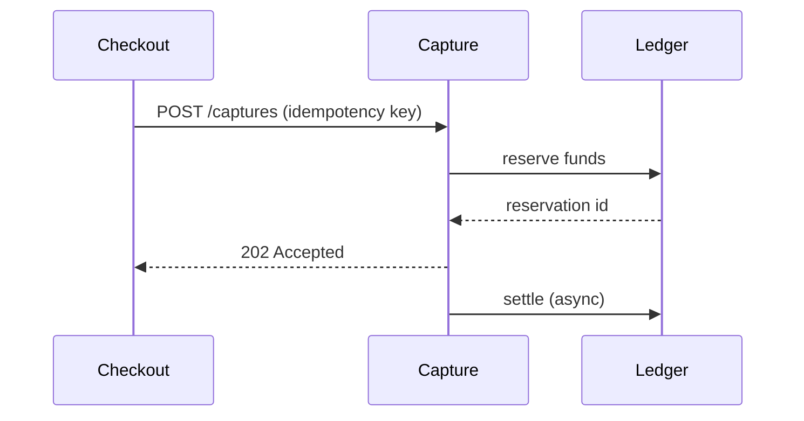

# Payment capture design

Certainly! Here's the updated design document you asked for.

## Overview

The capture service turns an authorized payment into a settled one. A capture request is
idempotent: retrying with the same key returns the original result instead of double-charging.
Captures expire {{capture_ttl}} hours after authorization.



| Field | Type | Notes |
| --- | --- | --- |
| `payment_id` | string | The authorized payment to capture |
| `amount` | integer | Minor units; must not exceed the authorization |
| `idempotency_key` | string | Client-generated, unique per capture intent |

## Acceptance criteria

- [x] A capture within the authorized amount settles exactly once.
- [x] A duplicate idempotency key returns the first capture's result.
- [ ] A capture above the authorized amount is rejected with `422`.
- [ ] TODO: define the partial-capture behaviour.

We should probably cache the ledger's reservation state, see
https://internal.example/ledger/reservations for the schema.

```python
def capture(payment_id: str, amount: int, key: str) -> Capture:
    existing = store.by_key(key)
    if existing:
        return existing
    return ledger.settle(payment_id, amount, key)
```

The rest of the document is unchanged.
