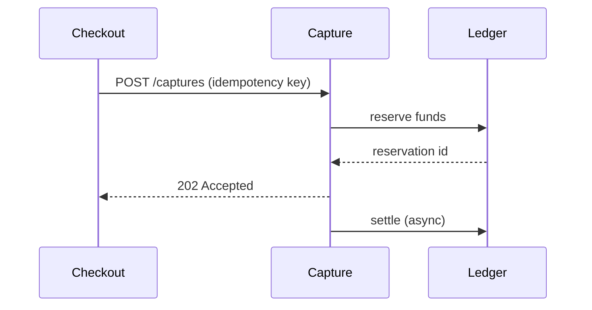

# Payment capture design

## Overview

The capture service turns an authorized payment into a settled one. A capture request is
idempotent: retrying with the same key returns the original result instead of double-charging.
Captures expire 36 hours after authorization.



| Field | Type | Notes |
| --- | --- | --- |
| `payment_id` | string | The authorized payment to capture |
| `amount` | integer | Minor units; must not exceed the authorization |
| `idempotency_key` | string | Client-generated, unique per capture intent |

## Acceptance criteria

- [x] A capture within the authorized amount settles exactly once.
- [x] A duplicate idempotency key returns the first capture's result.
- [ ] A capture above the authorized amount is rejected with `422`.
- [ ] A partial capture releases the unreserved remainder within one settlement cycle.

The ledger's reservation state is cached for one settlement cycle, per the
[reservation schema](https://internal.example/ledger/reservations). Retry semantics follow
https://internal.example/standards/retries as adopted last quarter.

```python
def capture(payment_id: str, amount: int, key: str) -> Capture:
    existing = store.by_key(key)
    if existing:
        return existing
    return ledger.settle(payment_id, amount, key)
```

## Rollout

Captures roll out behind the `capture-v2` flag, tenant by tenant, largest first. The flag
holds at 5% for the first 48 hours; a settlement mismatch above 0.01% pauses the rollout
automatically.
